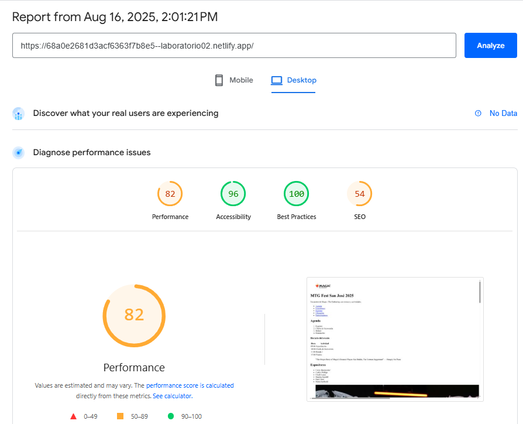
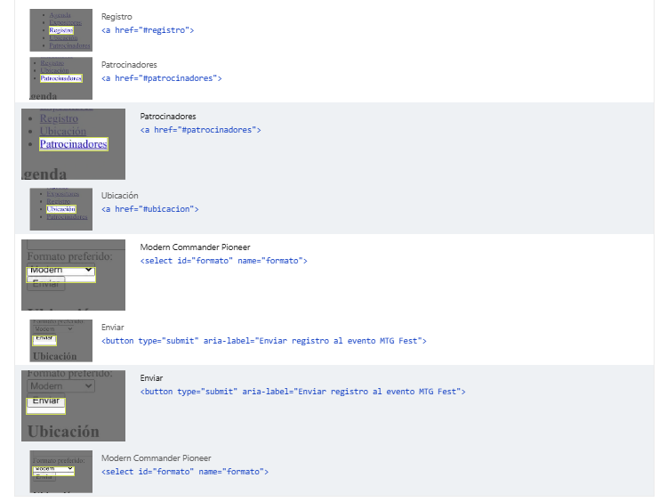

# MTG Fest San José 2025  

**Descripción del sitio:**  
Página informativa sobre el evento **MTG Fest San José 2025**, un encuentro de *Magic: The Gathering* con torneos, charlas, expositores internacionales, registro en línea y detalles de ubicación.  


## Estructura semántica del sitio  

- **`<header>`** → Contiene el logo, título principal y descripción del evento.  
- **`<nav>`** → Menú de navegación con enlaces a secciones clave (agenda, expositores, registro, ubicación, patrocinadores).  
- **`<main>`** → Contenido principal del sitio, dividido en varios `<article>`:  
  - **Agenda**: lista de actividades y tabla de horarios.  
  - **Expositores**: lista de ponentes y foto ilustrativa.  
  - **Registro**: formulario para inscribirse en el evento.  
  - **Ubicación**: información del lugar con imagen del centro de convenciones.  
  - **Patrocinadores**: lista de entidades colaboradoras.  
- **`<figure>` y `<figcaption>`** → Imágenes ilustrativas con descripciones.  
- **`<blockquote>`** → Cita de un video relacionado con el evento.  
- **`<aside>`** → Información adicional con consejos útiles para los asistentes.  
- **Formularios (`<form>`, `<label>`, `<input>`, `<select>`, `<button>`)** → Sección de registro interactivo.  


## URL pública de Netlify
##### https://68a0e2681d3acf6363f7b8e5--laboratorio02.netlify.app/

## Validación W3C
Para la sección de la validación se utilizó la herramienta recomendada W3C como se puede ver en las siguientes imagenes.
Dentro de las recomendaciones que plantea W3C se destacan que los elementos  de la página se organizan según el tipo de texto alternativo que poseen. Para las imágenes que cuentan con un texto alternativo (alt), es importante revisar que dicho texto tenga sentido y refleje correctamente el propósito de la imagen dentro del contexto de la página, evitando frases genéricas como “Imagen de …”. Por otro lado, las imágenes icónicas que solo repiten información ya presente en el texto o que son puramente decorativas deberían llevar un alt="" para que sean ignoradas por los lectores de pantalla.
Por otra parte, solo hay un uso de aria-*, aria-label en el botón.


## Lighthouse




## Accesibilidad aplicada
#### Enlaces descriptivos
Para los enleces descriptivos se utilizó en el siguiente bloque de codigo para que cada enlace indique claramente a qué sección llevará al usuario.
 
```<li><a href="#agenda">Agenda</a></li>```
```<li><a href="#expositores">Expositores</a></li>```
```<li><a href="#registro">Registro</a></li>```
```<li><a href="#ubicacion">Ubicación</a></li>```
```<li><a href="#patrocinadores">Patrocinadores</a></li>```

Tambien en los enleces del video externo, en dónde se describe exactamente qué verá el usuario al hacer clic, cumpliendo con buenas prácticas de accesibilidad.:
``` <a href="https://www.youtube.com/watch?v=PMprg7x-mrc&t=7s" target="_blank" rel="noopener noreferrer"> La historia del GOAT, Kai Budde</a> ```
#### Uso del alt
Todas las imágenes relevantes incluyen el atributo alt con texto descriptivo. Ejemplos:
``````
``````
